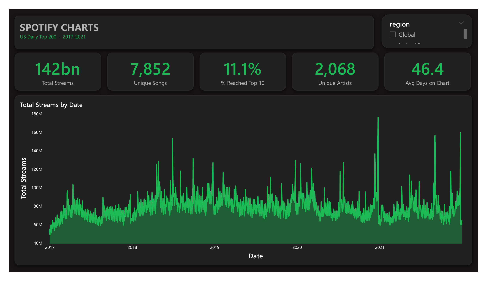
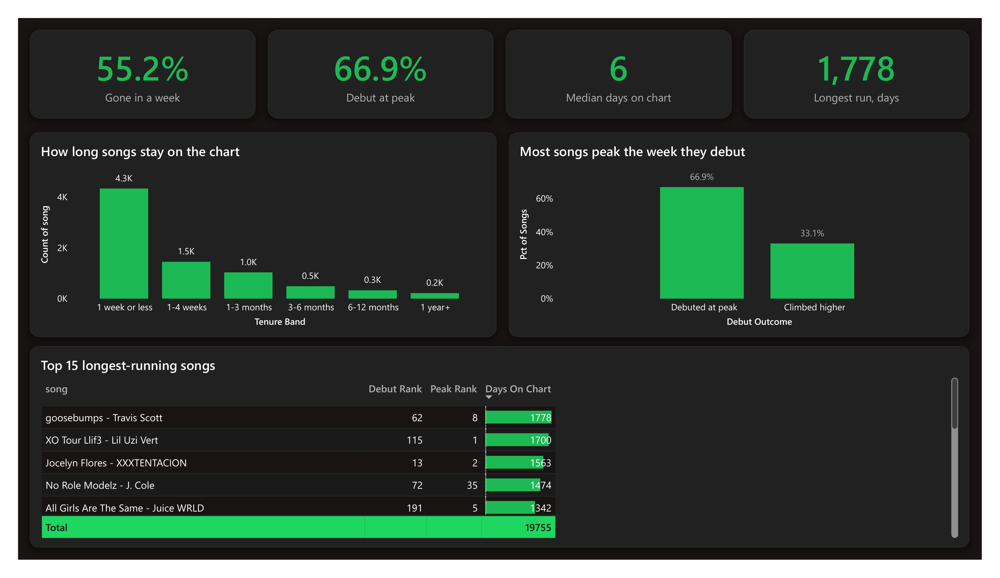
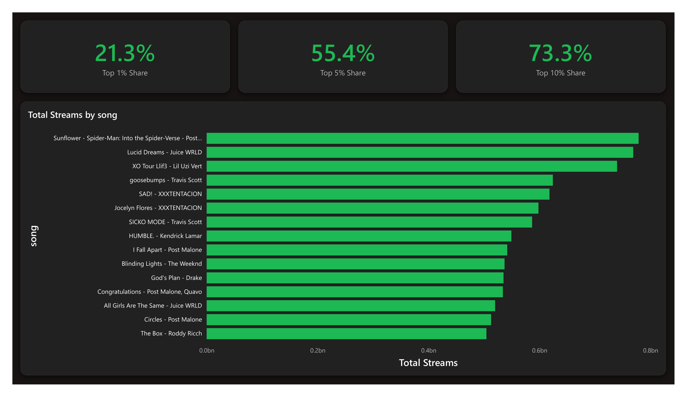
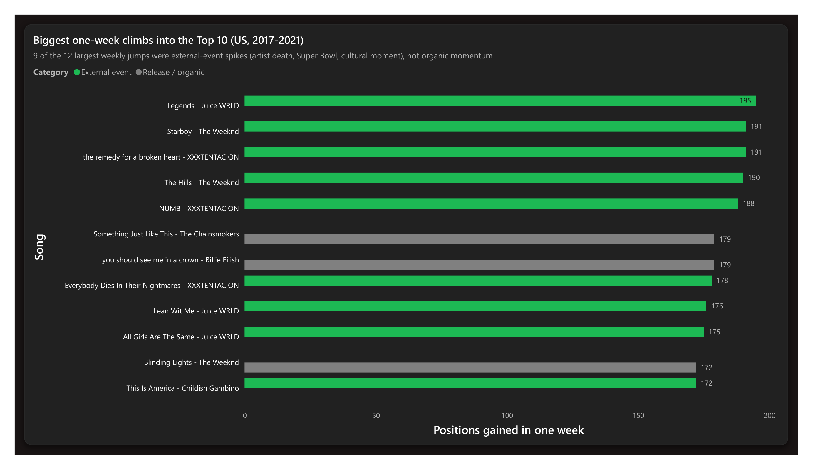

# Spotify Charts: What Makes a Song Climb

Analyzing five years of daily Spotify chart data (2017-2021) to understand how songs move on and off the charts, where streaming is concentrated, and what momentum signals come before a track breaks into the top 10.

This is a portfolio project. The data is real chart data scraped from Spotify's public charts; the findings are for skill demonstration, not label strategy.

## The Questions

1. What does a typical chart run look like, and what separates songs that climb and stay from one-week spikes?
2. How concentrated is streaming, and has that shifted over time?
3. Which momentum signals tend to come before a song reaching the top 10?

## Stack

- **Python (Pandas):** filter the raw 26M-row file to a clean regional slice, validate, prep for analysis
- **SQL (window functions, CTEs):** chart-run analysis, rank deltas, streaming concentration, momentum
- **Power BI:** interactive chart-dynamics dashboard
- **GitHub:** version control

## Repo Structure

```
spotify-charts-analysis/
├── data/         # Slim filtered CSV (raw 3.4GB file is gitignored)
├── sql/          # SQL scripts, named by analysis
├── notebooks/    # Jupyter notebook for prep and EDA
├── powerbi/      # .pbix dashboard
├── screenshots/  # Dashboard page previews
└── README.md
```

## Dashboard

A four-page Power BI dashboard (`powerbi/spotify-chart-dynamics.pbix`) on a custom Spotify dark theme. The previews below are rendered from the same US Top 200 slice the dashboard is built on.

**Overview** — headline KPIs and the streaming trend across five years.



**Chart Dynamics** — how long songs last, where they debut versus peak, and the longest-running runs.



**Concentration** — how few songs capture most of the streams.



**Climbers** — the biggest single-week climbs into the Top 10, colored by what drove them. 9 of the 12 largest jumps were external-event spikes (artist death, Super Bowl, cultural moment), not organic momentum.



## Key Findings

Across 7,878 songs that charted in the US Top 200 (2017-2021):

- **Staying power is rare.** 55% of charting songs lasted a week or less; the median run was 6 days. The outlier is Travis Scott's "goosebumps" at 1,778 days.
- **The top 10 is mostly an event, not a journey.** Only 11% of songs ever reached the top 10, and 69% of those debuted there. True slow burns are 10% of top-10 songs but average 215 days to break through.
- **Streaming is heavily concentrated.** The top 1% of songs captured ~21% of streams, the top 5% more than half, and the top 10% ~73%.
- **The biggest jumps are events, not momentum.** Of the 12 sharpest single-week climbs into the top 10, 9 were driven by external events (an artist's death, a Super Bowl performance) rather than organic build. Juice WRLD's "Legends" made the single largest move, 195 spots, the week after his death. The useful signal is telling an event spike apart from a genuine climber.

## Case Study

Full write-up (Problem, Approach, Insights, and what I would do with it) in [CASE_STUDY.md](CASE_STUDY.md).
